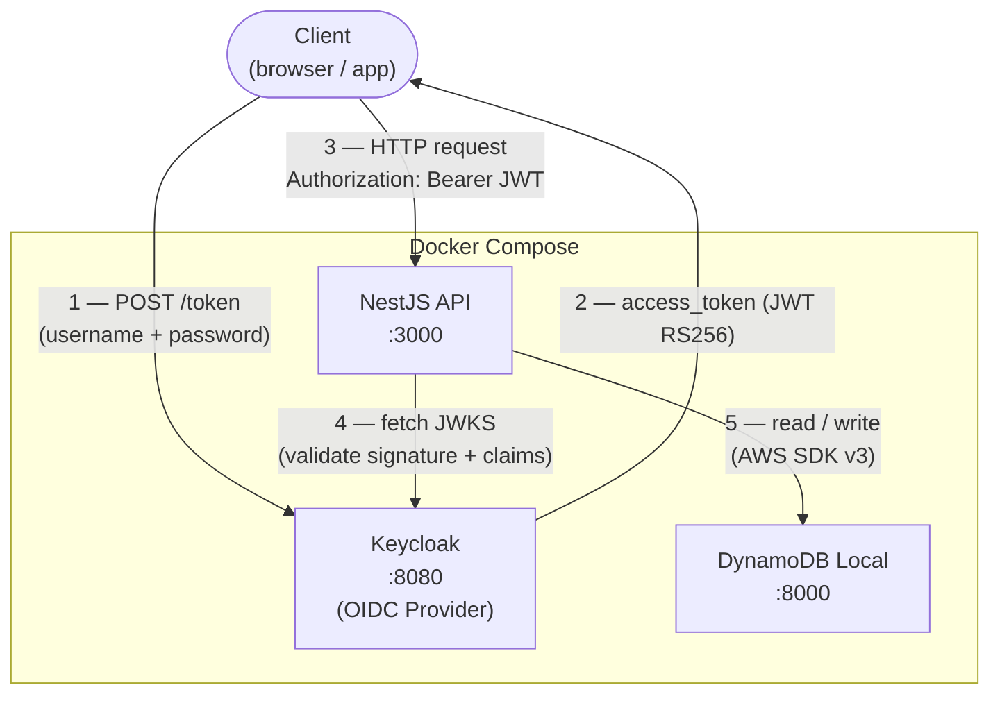
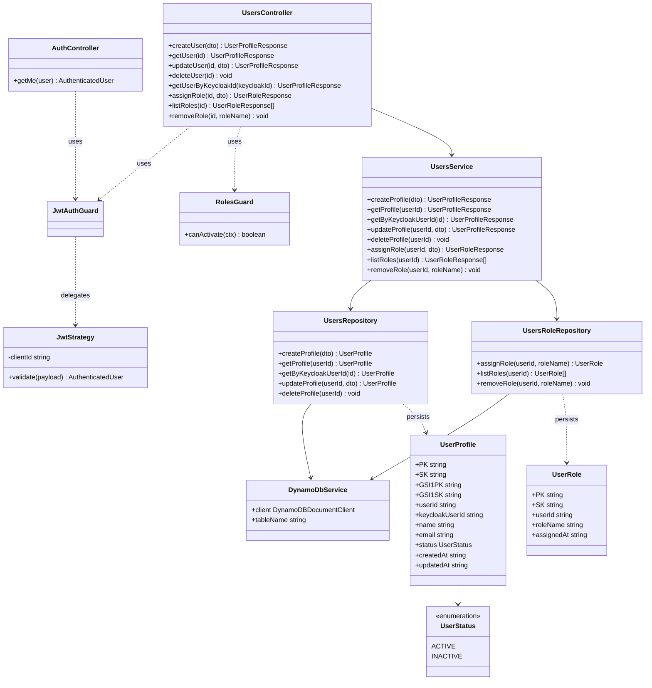
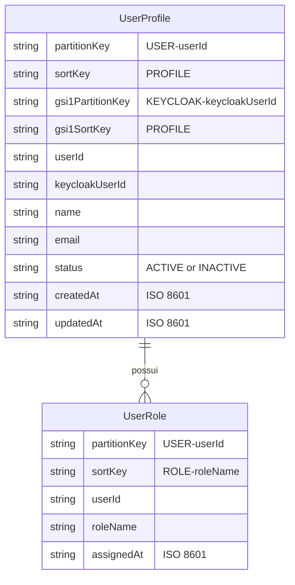

# NestJS Keycloak DynamoDB Starter

Production-ready starter API using NestJS, Keycloak OpenID Connect JWT validation, and DynamoDB single-table persistence.

## System Design



## Class Diagram



## Database Design

Single-table design no DynamoDB. Tabela: `event-system`.

### Chaves e índices

| | Tabela principal | GSI1 |
|---|---|---|
| Partition key | `PK` | `GSI1PK` |
| Sort key | `SK` | `GSI1SK` |

### Estrutura dos itens



### Access patterns

| Operação | Índice | Condição |
|---|---|---|
| Buscar perfil por `userId` | Tabela | `PK = USER#<userId>` AND `SK = PROFILE` |
| Buscar perfil por `keycloakUserId` | GSI1 | `GSI1PK = KEYCLOAK#<id>` AND `GSI1SK = PROFILE` |
| Listar roles de um usuário | Tabela | `PK = USER#<userId>` AND `SK begins_with ROLE#` |
| Buscar role específica | Tabela | `PK = USER#<userId>` AND `SK = ROLE#<roleName>` |

## Stack

- NestJS with TypeScript
- Keycloak JWT authentication using `passport-jwt` and `jwks-rsa`
- Role authorization with `RolesGuard` and `@Roles()`
- AWS SDK v3 DynamoDB document client
- Swagger at `GET /docs`
- Docker Compose for Keycloak and DynamoDB Local

## Folder Structure

```text
.
├── src
│   ├── auth
│   │   ├── decorators
│   │   │   ├── current-user.decorator.ts
│   │   │   └── roles.decorator.ts
│   │   ├── guards
│   │   │   ├── jwt-auth.guard.ts
│   │   │   └── roles.guard.ts
│   │   ├── strategies
│   │   │   └── jwt.strategy.ts
│   │   ├── auth.controller.ts
│   │   ├── auth.module.ts
│   │   └── types.ts
│   ├── config
│   │   └── configuration.ts
│   ├── database
│   │   ├── database.module.ts
│   │   └── dynamodb.service.ts
│   ├── users
│   │   ├── dto
│   │   │   ├── assign-role.dto.ts
│   │   │   ├── create-user-profile.dto.ts
│   │   │   ├── update-user-profile.dto.ts
│   │   │   ├── user-profile.response.ts
│   │   │   └── user-role.response.ts
│   │   ├── entities.ts
│   │   ├── user-status.enum.ts
│   │   ├── users.controller.ts
│   │   ├── users.module.ts
│   │   ├── users-role.repository.ts
│   │   ├── users.repository.ts
│   │   └── users.service.ts
│   ├── app.module.ts
│   └── main.ts
├── docker-compose.yml
├── Dockerfile
├── .env
├── .env.example
└── package.json
```

## Environment

```env
PORT=3000
KEYCLOAK_URL=http://localhost:8080
KEYCLOAK_REALM=event-system
KEYCLOAK_CLIENT_ID=nest-api
AWS_REGION=us-east-1
DYNAMODB_ENDPOINT=http://localhost:8000
DYNAMODB_TABLE_NAME=event-system
```

## Single-Table Design

Table name: `event-system`

Primary key:

- `PK` string
- `SK` string

Global secondary index:

- `GSI1`
- partition key: `GSI1PK`
- sort key: `GSI1SK`

Items:

```text
UserProfile
PK       USER#<userId>
SK       PROFILE
GSI1PK   KEYCLOAK#<keycloakUserId>
GSI1SK   PROFILE

UserRole
PK       USER#<userId>
SK       ROLE#<roleName>
```

## Install

```bash
npm install
```

## Start Keycloak and DynamoDB Local

```bash
docker compose up -d
```

This starts Keycloak, DynamoDB Local, runs the table init script automatically, and starts the API. To run only the infrastructure (without the app container):

```bash
docker compose up -d keycloak dynamodb-local dynamodb-init
```

Keycloak admin console:

- URL: `http://localhost:8080`
- username: `admin`
- password: `admin`

Create a realm named `event-system`, then create a client named `nest-api`. Configure the client so access tokens include `aud: nest-api`; Keycloak often needs an audience mapper for this.

## Create the DynamoDB Table Locally

Install and configure the AWS CLI, then run:

```bash
aws dynamodb create-table \
  --table-name event-system \
  --attribute-definitions \
    AttributeName=PK,AttributeType=S \
    AttributeName=SK,AttributeType=S \
    AttributeName=GSI1PK,AttributeType=S \
    AttributeName=GSI1SK,AttributeType=S \
  --key-schema \
    AttributeName=PK,KeyType=HASH \
    AttributeName=SK,KeyType=RANGE \
  --global-secondary-indexes \
    "IndexName=GSI1,KeySchema=[{AttributeName=GSI1PK,KeyType=HASH},{AttributeName=GSI1SK,KeyType=RANGE}],Projection={ProjectionType=ALL},ProvisionedThroughput={ReadCapacityUnits=5,WriteCapacityUnits=5}" \
  --provisioned-throughput ReadCapacityUnits=5,WriteCapacityUnits=5 \
  --endpoint-url http://localhost:8000 \
  --region us-east-1
```

For DynamoDB Local, dummy credentials are enough:

```bash
export AWS_ACCESS_KEY_ID=local
export AWS_SECRET_ACCESS_KEY=local
```

## Run the API

```bash
npm run start:dev
```

Open Swagger:

```text
http://localhost:3000/docs
```

## Endpoints

All endpoints require a Bearer token from Keycloak.

| Method | Path | Description |
|--------|------|-------------|
| `GET` | `/me` | Returns the authenticated user's claims from the JWT |
| `POST` | `/users` | Creates a user profile in DynamoDB |
| `GET` | `/users/:id` | Returns a user profile by internal `userId` |
| `PATCH` | `/users/:id` | Updates a user profile |
| `DELETE` | `/users/:id` | Deletes a user profile |
| `GET` | `/users/by-keycloak/:keycloakId` | Returns a user profile by Keycloak subject ID |
| `POST` | `/users/:id/roles` | Assigns a role to a user |
| `GET` | `/users/:id/roles` | Lists all roles assigned to a user |
| `DELETE` | `/users/:id/roles/:roleName` | Removes a role from a user |

## Example Requests

```bash
curl http://localhost:3000/me \
  -H "Authorization: Bearer $ACCESS_TOKEN"
```

```bash
curl -X POST http://localhost:3000/users \
  -H "Authorization: Bearer $ACCESS_TOKEN" \
  -H "Content-Type: application/json" \
  -d '{
    "keycloakUserId": "keycloak-sub",
    "name": "Ada Lovelace",
    "email": "ada@example.com",
    "status": "ACTIVE"
  }'
```

```bash
curl -X POST http://localhost:3000/users/$USER_ID/roles \
  -H "Authorization: Bearer $ACCESS_TOKEN" \
  -H "Content-Type: application/json" \
  -d '{"roleName": "organizador"}'
```

```bash
curl http://localhost:3000/users/$USER_ID/roles \
  -H "Authorization: Bearer $ACCESS_TOKEN"
```

```bash
curl -X DELETE http://localhost:3000/users/$USER_ID/roles/organizador \
  -H "Authorization: Bearer $ACCESS_TOKEN"
```

```bash
curl http://localhost:3000/users/by-keycloak/$KEYCLOAK_ID \
  -H "Authorization: Bearer $ACCESS_TOKEN"
```

## Automated Keycloak Auth Flow Test

This project includes `scripts/test-keycloak-auth-flow.sh` to verify:

- `GET /me` returns `401` without token
- `GET /me` returns `200` with Keycloak token
- `POST /users` works with a valid token
- `GET /users/:id` fetches the created profile

Set credentials for a Keycloak user in `event-system` realm:

```bash
export KEYCLOAK_USERNAME={{KEYCLOAK_USERNAME}}
export KEYCLOAK_PASSWORD={{KEYCLOAK_PASSWORD}}
```

Optional overrides:

```bash
export KEYCLOAK_URL=http://localhost:8080
export KEYCLOAK_REALM=event-system
export KEYCLOAK_CLIENT_ID=nest-api
export API_URL=http://localhost:3000
```

Run:

```bash
npm run test:auth-flow
```
## Production Notes

- Replace Keycloak `start-dev` with a production Keycloak setup before deploying.
- Use a managed DynamoDB table and remove `DYNAMODB_ENDPOINT` outside local development.
- Configure the Keycloak client audience mapper so `aud` contains `nest-api`.
- Store secrets and environment variables in your deployment platform, not in `.env`.
